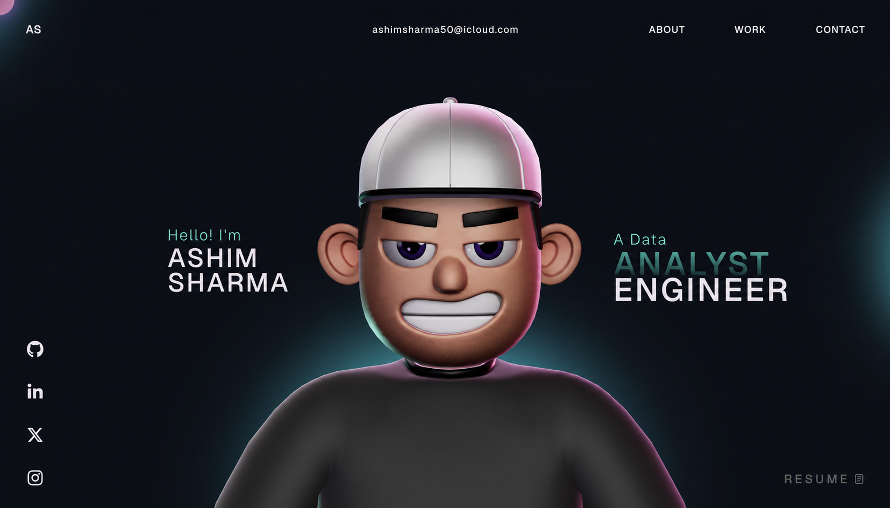
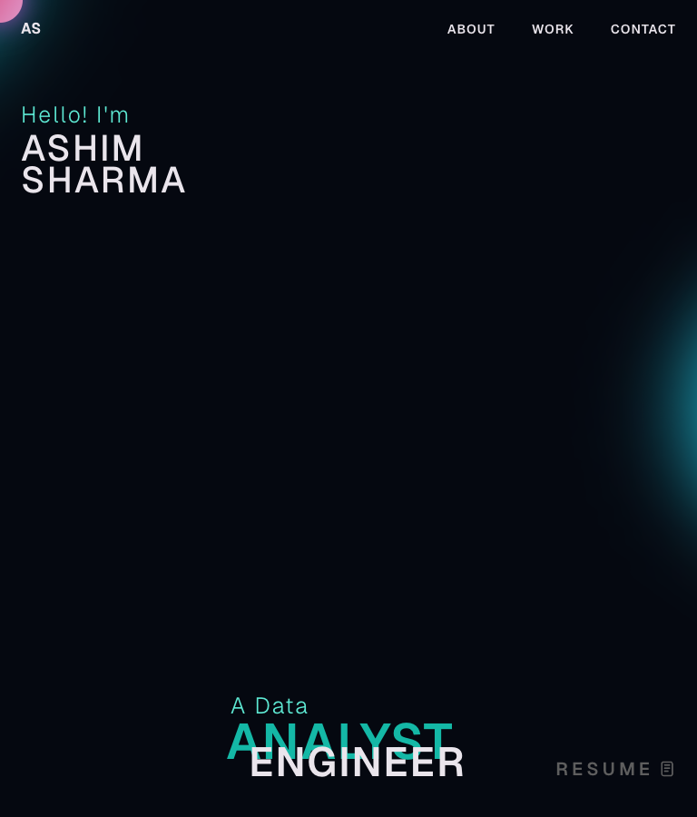

# Ashim Sharma — Data Analyst & Data Engineer

An interactive portfolio presenting my experience, projects, and technical skills across data analytics and data engineering.



## About me

I am a Data Analyst and Data Engineer with six years of experience transforming complex data into reliable pipelines, useful reporting, and actionable business insights. My work spans banking, logistics, retail, and e-commerce, with a focus on scalable ETL systems, workflow automation, data quality, and analytical storytelling.

## Portfolio highlights

- Professional experience at EXL Services, FPT Software Vietnam, Cognizant Technology, and Marshal Sales Corporation
- Visa and banking projects covering customer segmentation, transaction forecasting, behavioral analytics, and quality automation
- Interactive data-stack visualization
- Responsive desktop and mobile experience
- Animated 3D character, smooth scrolling, and project carousel
- Direct links to GitHub, LinkedIn, Udacity, and HackerRank credentials

## Data stack

**Languages and analytics:** Python, SQL, Pandas, NumPy, Matplotlib, Scikit-learn, PySpark

**Data engineering:** Apache Airflow, ETL, data warehousing, AWS, Amazon Redshift

**Databases:** Microsoft SQL Server, MySQL, PostgreSQL, MongoDB

**Visualization and tools:** Power BI, Tableau, Advanced Excel, Jupyter Notebook, GitHub, JIRA, Postman, PyCharm, Visual Studio

## Portfolio technology

- React and TypeScript
- Vite
- GSAP and ScrollTrigger
- Three.js and React Three Fiber
- React Three Rapier
- CSS

## Screenshots

### Desktop


### Mobile



## Run locally

```bash
git clone https://github.com/ashim1600/Ashim_portfolio.git
cd Ashim_portfolio
npm install
npm run dev
```

Open [http://localhost:5173](http://localhost:5173) in your browser.

## Production build

```bash
npm run build
npm run preview
```

## Contact

- Email: [ashimsharma50@icloud.com](mailto:ashimsharma50@icloud.com)
- LinkedIn: [ashimsharma1609](https://www.linkedin.com/in/ashimsharma1609/)
- GitHub: [ashim1600](https://github.com/ashim1600)

## License

This project is available under the [MIT License](LICENSE).
